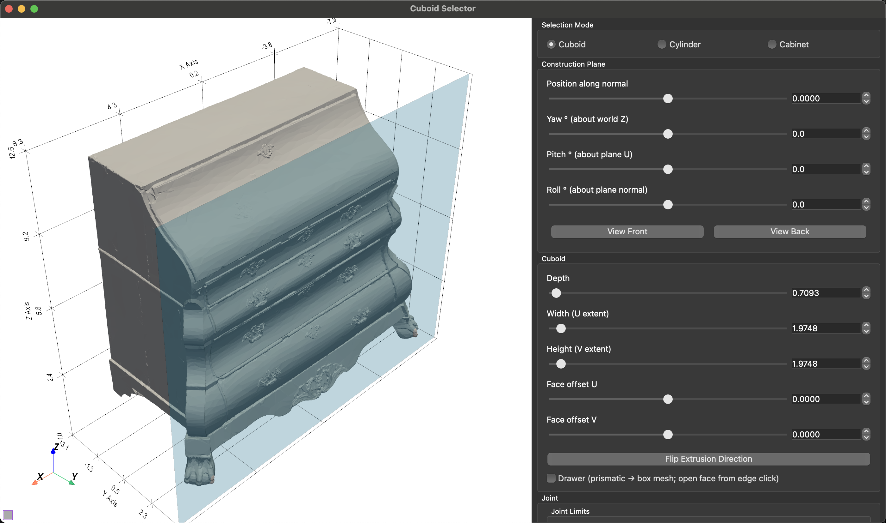
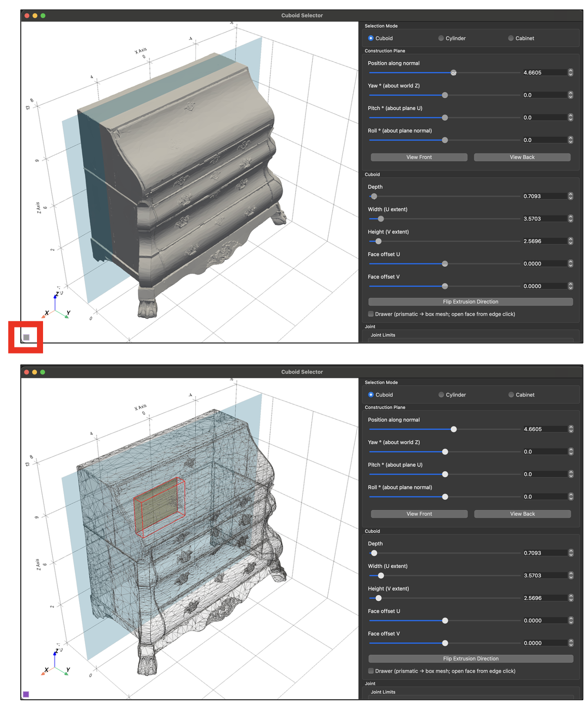
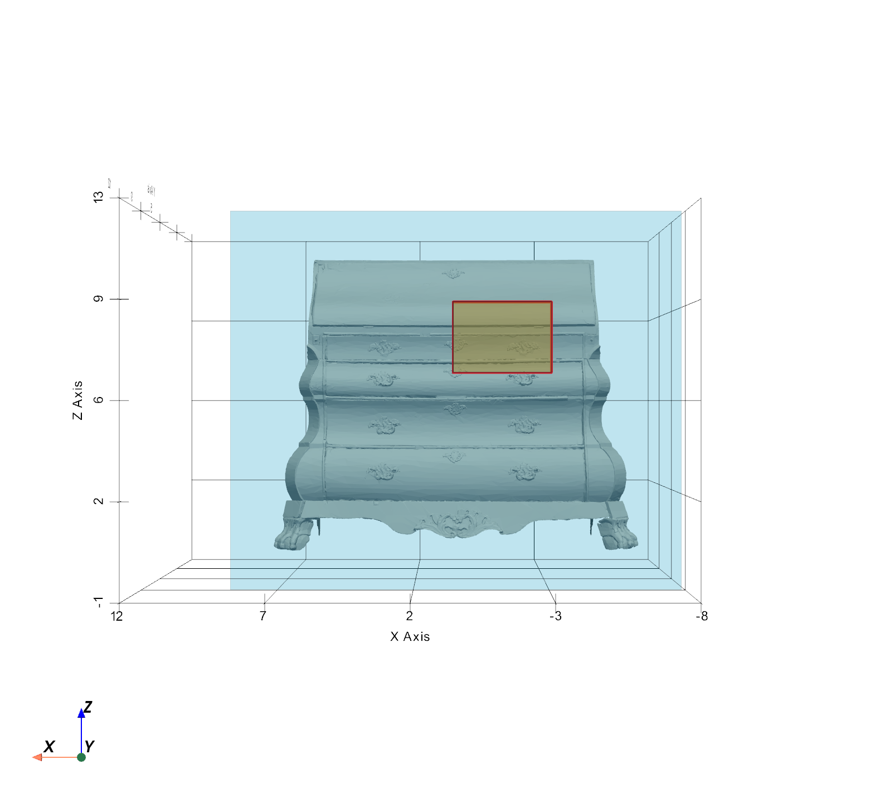
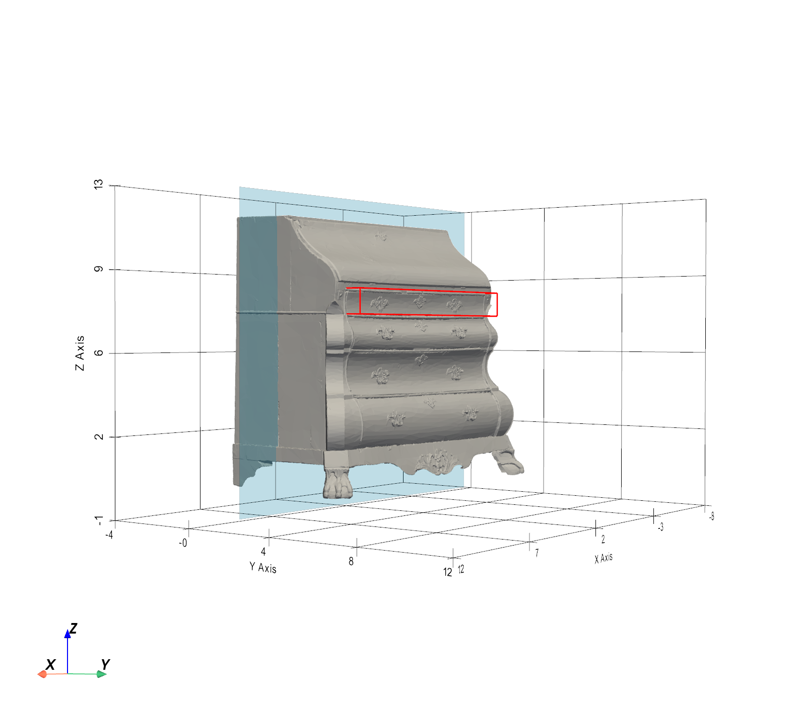
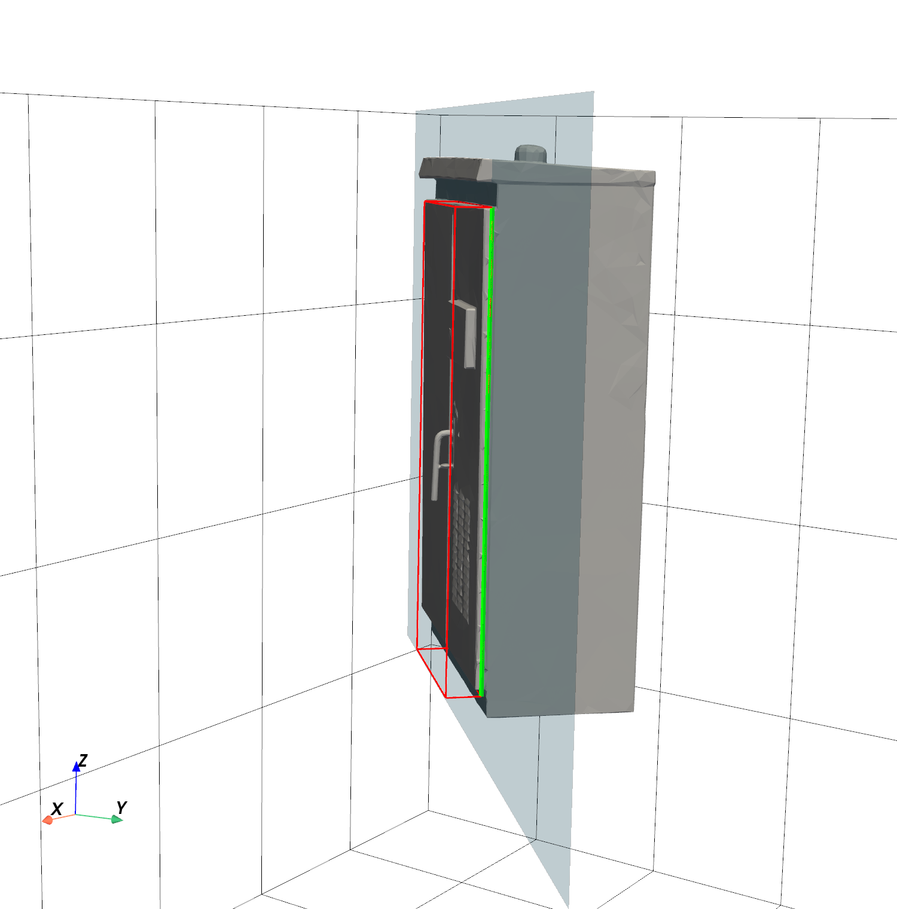
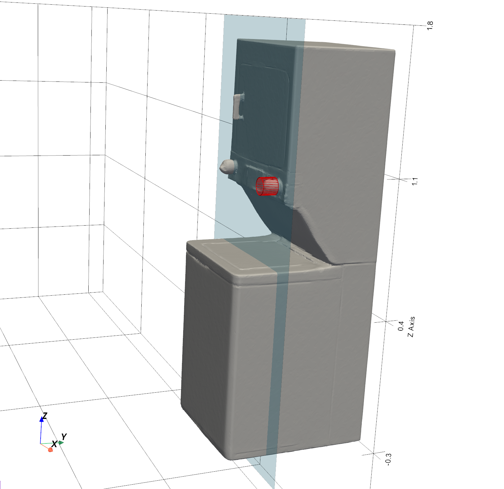
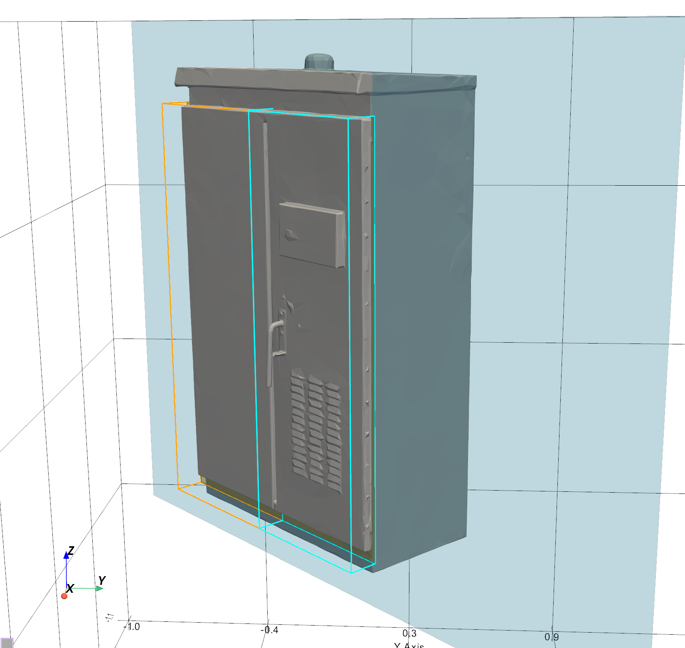
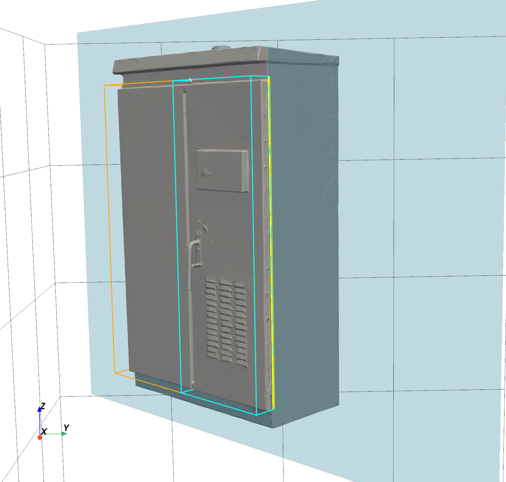
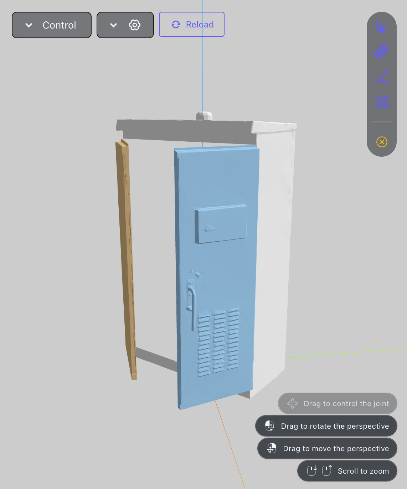

# Usage Reference

This page covers every control in the Asset Articulator UI in detail.
For a high-level overview and installation, see the [README](../README.md).

---

## Launching the Tool

```bash
python scripts/cuboid_selector.py path/to/your/mesh.stl
```

Supported mesh formats: anything trimesh can load (`.stl`, `.ply`, `.obj`, `.glb`, …).

The window opens with your mesh displayed in grey and a translucent blue **construction plane** overlaid on it.



---

## UI Layout


- **Left**: interactive 3-D viewport. Left-click to pick points on the mesh or plane.
- **Right**: control panel (scrollable). All annotation happens here.
- **Status bar** (bottom of panel): real-time feedback on what the tool expects next. Always check it when something unexpected happens — it also prints to the terminal.

---

## X-Ray Toggle

A small checkbox button is embedded in the bottom-left corner of the viewport. When enabled:
- The mesh becomes semi-transparent (15% opacity).
- A wireframe overlay appears.

Use this when your mesh surface obscures the construction plane or a cuboid you are positioning.



---

## Selection Mode

Three radio buttons switch between annotation modes. Switching resets the current face selection.

| Mode | Use for |
|---|---|
| **Cuboid** | Doors, panels, flat-faced drawers — any part with a roughly rectangular cross-section |
| **Cylinder** | Knobs, dials, circular hinges — any part with a circular cross-section |
| **Cabinet** | Two co-planar doors sharing a single face (e.g. a double cabinet, adjacent drawers in a chest of drawers) |

---

## Construction Plane

The blue semi-transparent plane is the reference surface you click on to define selections. It does not interact with the mesh geometrically — it is only a picking surface.

### Position Along Normal
Slides the plane forward or backward along its own normal vector. Use this to align the plane with the face of the part you want to annotate. 

### Yaw / Pitch / Roll
Rotate the plane in 3-D:
- **Yaw** — rotates around the world Z axis (twisting left/right when viewed from above).
- **Pitch** — rotates around the plane's current U axis (tilting the plane up/down).
- **Roll** — rotates around the plane's normal (spinning the plane in-place).

All three default to 0 °, giving a plane initially aligned with XZ (facing along Y).

> **Tip**: position and orient the plane so it is flush with — or just in front of — the face of the part you want to capture.

### View Front / View Back
Snaps the camera to look straight along the plane normal (from the front or back). Useful for precisely placing clicks after rotating the plane.


> **Tip**: Orient the plane so that "front" matches the side the door or drawer should open toward — joint coordinates are derived from the plane orientation. If a door opens into the asset instead of outward, rotate the plane 180°.

---

## Cuboid Mode

### Defining the Face

1. Click once on the blue plane → sets corner **p0** (shown in the status bar).
2. Click again → sets corner **p1**. An orange rectangle appears showing the selected face. The **Width** and **Height** sliders auto-populate.

The face is the rectangle on the plane that the cuboid will be extruded from.



### Adjusting the Face

After clicking p0 and p1 you can fine-tune without re-clicking:

| Control | Effect |
|---|---|
| **Width (U extent)** | Resizes the face horizontally (centered on the clicked midpoint) |
| **Height (V extent)** | Resizes the face vertically |
| **Face offset U** | Shifts the entire face left/right along the plane |
| **Face offset V** | Shifts the entire face up/down along the plane |

> Changing any of these clears the current joint selection — reselect the hinge/slider edge afterwards.

### Depth

Controls how far the cuboid extends behind the face (into the mesh). Set this to be deep enough to fully enclose the moving part. The depth of this mesh is used to infer the door width (how thick a door is) or drawer width (how deep in a drawer goes).




### Flip Extrusion Direction

By default the cuboid extrudes in the **-normal** direction (into the mesh). Click this to flip it to **+normal** (out from the mesh). Use when the moving part protrudes outward rather than being recessed.

### Drawer Checkbox

Check **Drawer (prismatic → box mesh; open face from edge click)** before selecting a joint to switch prismatic behaviour:
- The tool auto-sets joint limits to `[0, depth]` in metres.
- After clicking near an edge, it infers which side of the cuboid is the "open face" from the position of the edge you clicked.
- The exported mesh has that face removed (an open box, like a real drawer).

Leave unchecked for a standard sliding panel with user-defined limits.

---

## Joint Setup (Cuboid and Cylinder Modes)

### Setting Limits

Before clicking a joint button, set **Lower limit** and **Upper limit**:
- In **Revolute** mode: values are in **degrees** (e.g. `−90` to `0` for a door that opens 90 °).
- In **Prismatic** mode: values are in **metres** (e.g. `0` to `0.3` for a drawer that pulls out 30 cm).
- When **Drawer** is checked, limits are derived automatically from the depth of the cuboid.

Lower must be strictly less than upper.

### Select Hinge (Revolute)

1. Set limits.
2. Click **Select Hinge (Revolute)** → button changes to `→ click near edge…`
3. Left-click anywhere near the cuboid edge you want as the hinge axis. The nearest cuboid edge highlights green.

The hinge axis is the selected edge — the child link rotates around the line between its two endpoints. The nearest edge to your click in 3-D world space is selected, so click as close to the intended edge as possible.



### Select Slider (Prismatic)

1. Set limits (or check **Drawer** to auto-set).
2. Click **Select Slider (Prismatic)** → button changes to `→ click near edge…`
3. Left-click near the edge that defines the slide direction. For a typical drawer this is a bottom or top face edge.

### Select Axis (Revolute) — Cylinder Mode Only

After defining a cylinder (center + radius), click **Select Axis (Revolute)**. The cylinder's own central axis is used as the joint axis — no additional click needed.

---

## Cylinder Mode

1. Click once on the plane → sets the **cylinder center**.
2. Click again at any point on the intended perimeter → sets the **radius**.
3. Adjust **Depth** to control cylinder height.
4. Click **Select Axis (Revolute)** to assign a revolute joint along the cylinder axis.
5. Click **Add Cylinder** to queue it.

Face Offset U/V shifts the cylinder center after it is placed.



---

## Cabinet Mode

Cabinet mode annotates two co-planar doors in a single workflow.

### Step 1 — Define the Face
Click twice on the plane exactly as in Cuboid mode. Both sub-doors share this outer face rectangle.

### Step 2 — Pick the Split Line
Click on one of the four edges of the orange face rectangle:
- **Top or bottom edge** → creates a **vertical** split line (left door / right door).
- **Left or right edge** → creates a **horizontal** split line (bottom door / top door).

The split position is set by the U or V coordinate of where you clicked. A white line appears across the face showing the split. A white dot marks the snap point on the edge you clicked.



Use **Re-pick Split Line** to redo this step without redefining the face.

### Step 3 — Select Hinges (or Slider Edges)
Two sub-cuboids appear (orange and cyan wireframes). For each:
1. Click **Select Left Hinge** (or **Select Bottom Hinge** for horizontal splits).
2. Click near the intended hinge edge on that sub-cuboid. It highlights green or yellow.
3. Repeat for the right / top sub-cuboid.

If **Drawer** is checked, the buttons are labelled "Slider Edge" instead of "Hinge", and both doors become prismatic joints.

Joint limits from the **Lower / Upper limit** sliders apply to both sub-doors.



### Finishing
Click **Add Cabinet** once both edges are selected. Both primitives are queued as separate entries.

---

## Actions

### Reset Face Selection
Clears the current face (p0/p1), the cuboid preview, and any armed joint. Does **not** remove already-queued doors.

### Add Door / Drawer
Queues the current cuboid + joint as one articulated link. The cuboid wireframe turns green and stays visible. The face resets automatically so you can immediately start on the next door.

> If the new cuboid overlaps an already-queued one, an error is shown and nothing is added.

### Add Cylinder
Same as Add Door / Drawer but for cylinder mode.

### Clear All Selections
Removes all queued articulations (green wireframes disappear). The mesh is unchanged.

### Print Cuboid Info
Prints the current cuboid's `center`, `rotation`, and `extents` to the terminal as copy-pasteable Python. Useful for hardcoding a selection to reproduce later.

### Slice Only

When checked, **Export URDF** instead exports a single `.glb` file, `sliced_combined.glb`, containing the base mesh and all door meshes as separate named objects in one scene. No URDF is written.

Use this mode to inspect the split geometry in a mesh viewer before committing to URDF export. It is also useful for creating `.glb` files that can later be imported into software such as Blender, where the separated objects can be integrated into an existing hierarchy and used with URDF-generation tools like Phobos. Useful for when an enviironment is created using meshes sourced from multiple sources and manual modelling instead of a single 3D scan. 

### Export URDF
Finalises the export:

1. Computes the **base mesh** by sequentially removing each queued door's region from the original mesh.
2. Saves `base.stl`, `door_0.stl`, `door_1.stl`, … to `data/output/<mesh-stem>/`.
3. Writes `<mesh-stem>.urdf` in the same directory.

**URDF structure:**
```
<robot>
  <link name="base">   ← remainder of original mesh
  <link name="door_0"> ← first queued child mesh
  <link name="door_1"> ← second queued child mesh
  ...
  <joint name="door_0_joint" type="revolute|prismatic">
    <parent link="base"/>
    <child link="door_0"/>
    <origin xyz="..."/>   ← hinge/slider edge p0 in world coords
    <axis xyz="..."/>     ← edge direction (p1 - p0), normalised
    <limit lower="..." upper="..."/>
  </joint>
  ...
</robot>
```

Child mesh vertices are stored **relative to the joint origin** (the first endpoint of the selected edge), so the URDF `<origin>` correctly positions each link.



---

## Typical Workflows

### Single door
1. Orient the plane flush with the door face.
2. Click p0, p1 to frame the door.
3. Adjust Depth to cover door thickness.
4. Click **Select Hinge**, click near the hinge edge.
5. Click **Add Door / Drawer**.
6. Click **Export URDF**.

### Double cabinet
1. Switch to **Cabinet** mode.
2. Click p0, p1 to frame both doors together.
3. Click the top or bottom edge of the face rectangle to set the split.
4. Select Left Hinge, Select Right Hinge.
5. Click **Add Cabinet**.
6. Click **Export URDF**.

### Drawer
1. Check **Drawer** in the Cuboid group.
2. Click p0, p1 to frame the drawer front.
3. Set Depth to the pull-out distance.
4. Click **Select Slider (Prismatic)** → click near the bottom face edge (or whichever edge is opposite the open side).
5. Click **Add Door / Drawer**.
6. Click **Export URDF**.

### Mixed (door + drawer on the same object)
Repeat the single-door or drawer workflow for each part, clicking **Add Door / Drawer** after each. All queued entries are exported together in one URDF.

---

## Known Limitations

- **Non-manifold meshes**: meshes with degenerate faces or internal geometry may produce incorrect clip boundaries. Run your mesh through a repair tool (e.g. `trimesh.repair`) before loading.
- **Overlapping selections**: the tool rejects a new cuboid if its triangles overlap an already-queued one. Reposition the cuboid to avoid overlap.
- **Very thin parts**: if the part is thinner than floating-point tolerance, the clip loop may be empty and the cap cannot be constructed. Increase selection area slightly.
- **Cylinder mode** only supports revolute joints — there is no prismatic cylinder joint.
